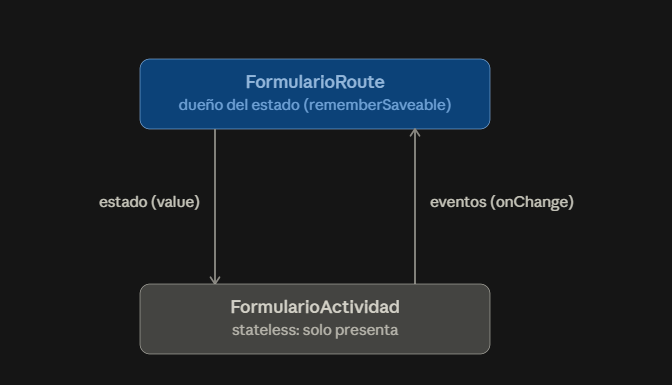
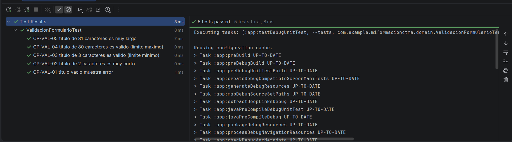

    # Planteamiento del problema

Actualmente, los aprendices administran sus actividades académicas, enlaces de acceso, evidencias y fechas de entrega utilizando diferentes canales y herramientas, como aplicaciones de mensajería, correos electrónicos y notas personales. Esta dispersión de la información ocasiona olvidos, pérdida de evidencias, duplicación de tareas y dificultades para realizar un seguimiento adecuado del proceso formativo. Asimismo, los instructores enfrentan limitaciones para comunicar actividades y criterios de evaluación de manera organizada, afectando la trazabilidad del aprendizaje. Desde el punto de vista del desarrollo, resulta necesario contar con una base técnica sólida que permita evolucionar la aplicación sin comprometer su estabilidad. Por ello, surge la necesidad de desarrollar **Mi Formación CTMA**, una aplicación Android que centralice la gestión académica y facilite la organización, la comunicación y el seguimiento del proceso formativo.

---

# Tipos de usuario y necesidades

| Tipo de usuario | Necesidad                                                                                                                                                                                                                 |
| --------------- | ------------------------------------------------------------------------------------------------------------------------------------------------------------------------------------------------------------------------- |
| **Aprendiz**    | Consultar actividades, fechas de entrega, enlaces y registrar el avance de sus evidencias desde un solo lugar, para organizar mejor su proceso de formación y reducir olvidos.                                            |
| **Instructor**  | Publicar actividades, compartir recursos, establecer criterios de evaluación y realizar seguimiento al progreso de los aprendices, garantizando una comunicación clara y una adecuada trazabilidad del proceso formativo. |

---

### Criterios de aceptacion por historia
## Historias de usuario

### Historia de usuario 1 — Consultar actividades

**Como aprendiz**, quiero consultar mis actividades registradas para conocer la información y los recursos asociados a cada una.

**Criterios de aceptación:**

* **Dado que** el aprendiz ha iniciado sesión, **cuando** acceda a la pantalla principal, **entonces** deberá visualizar sus actividades registradas.
* **Dado que** existen actividades registradas, **cuando** el aprendiz consulte una actividad, **entonces** deberá visualizar como mínimo su título, descripción y fecha de entrega.
* **Dado que** una actividad contiene un enlace, **cuando** el aprendiz consulte dicha actividad, **entonces** deberá poder acceder al enlace correspondiente.

---

### Historia de usuario 2 — Registrar avance

**Como aprendiz**, quiero actualizar el estado de mis actividades para llevar un seguimiento de mi progreso.

**Criterios de aceptación:**

* **Dado que** el aprendiz ha seleccionado una actividad, **cuando** cambie su estado a **"En progreso"**, **entonces** la aplicación deberá guardar y mostrar el nuevo estado.
* **Dado que** una actividad se encuentra en progreso, **cuando** el aprendiz la marque como **"Completada"**, **entonces** la aplicación deberá actualizar y guardar el estado.
* **Dado que** el aprendiz vuelva a consultar una actividad cuyo estado fue modificado, **cuando** acceda a ella, **entonces** deberá visualizar el último estado guardado.

---

### Historia de usuario 3 — Publicar actividades

**Como instructor**, quiero registrar y publicar actividades para que los aprendices puedan consultar la información y los recursos correspondientes.

**Criterios de aceptación:**

* **Dado que** el instructor ha iniciado sesión, **cuando** registre una actividad con título, descripción y fecha de entrega, **entonces** la aplicación deberá almacenarla correctamente.
* **Dado que** el instructor ha registrado una actividad, **cuando** agregue recursos o criterios de evaluación, **entonces** estos deberán quedar asociados a la actividad.
* **Dado que** una actividad ha sido publicada, **cuando** un aprendiz consulte sus actividades, **entonces** deberá poder visualizar la información publicada por el instructor.

### Criterios no funcional medible

### Identificacion de dependencias, supuestos y preguntas abiertas

## Dependencias y elementos externos

Son elementos externos o componentes de los que depende el funcionamiento del proyecto.

* **Android Studio:** para el desarrollo y ejecución de la aplicación.
* **Kotlin y Android SDK:** para la construcción de la aplicación Android.
* **Base de datos:** para almacenar usuarios, actividades, recursos, estados y criterios de evaluación.
* **Conexión a Internet:** para acceder a recursos externos y sincronizar información, dependiendo de la arquitectura definida.
* **Servicio de autenticación:** para diferenciar los permisos de aprendices e instructores, si se implementa autenticación mediante un servicio externo.
* **Navegador o aplicación compatible:** para abrir los enlaces externos asociados a las actividades.
Se recomienda incluir uno que sea fácil de demostrar y medir durante el proyecto:

**Rendimiento:** El 95 % de las operaciones principales de consulta y actualización de actividades deberán mostrar una respuesta en un tiempo máximo de **2 segundos**, bajo condiciones normales de funcionamiento y una conexión de red estable.

Este criterio es adecuado para el README porque no se queda en algo ambiguo como "la aplicación debe ser rápida".

También podrían agregarse posteriormente otros criterios, como disponibilidad, seguridad o usabilidad, pero con uno medible ya se cumple el requisito.

### Identificacion de dependencias, supuestos y preguntas abiertas

## 3. Dependencias

Son elementos externos o componentes de los que depende el funcionamiento del proyecto.

* **Android Studio:** para el desarrollo, compilación y ejecución de la aplicación.
* **Kotlin y Android SDK:** para la construcción y funcionamiento de la aplicación Android.
* **Base de datos:** para almacenar información relacionada con usuarios, actividades, recursos, estados y criterios de evaluación.
* **Conexión a Internet:** necesaria para acceder a recursos externos y sincronizar información, dependiendo de la arquitectura definida.
* **Servicio de autenticación:** utilizado para diferenciar los permisos de aprendices e instructores, en caso de implementar autenticación mediante un servicio externo.
* **Navegador o aplicación compatible:** necesario para abrir los enlaces externos asociados a las actividades.

## 4. Supuestos

Los supuestos son condiciones que se consideran ciertas para poder desarrollar el proyecto.

* Se asume que los usuarios tendrán un dispositivo Android compatible con la versión mínima definida para la aplicación.
* Se asume que cada usuario tendrá un tipo de rol definido: **aprendiz** o **instructor**.
* Se asume que los instructores serán responsables de registrar información correcta sobre las actividades, fechas y criterios de evaluación.
* Se asume que los aprendices tendrán acceso a las actividades correspondientes a su proceso formativo.
* Se asume que el usuario tendrá conexión a Internet para las funcionalidades que requieran sincronización con el servidor.
* Se asume que los enlaces y recursos publicados por los instructores serán accesibles y válidos.

## 5. Preguntas abiertas

Estas son decisiones que todavía deberían definirse durante el desarrollo del proyecto.

1. ¿Qué versión mínima de Android será compatible con la aplicación?
2. ¿La aplicación funcionará parcialmente sin conexión a Internet?
3. ¿Qué tecnología se utilizará para el backend y la base de datos?
4. ¿Cómo se realizará el inicio de sesión y la autenticación de los usuarios?
5. ¿Cómo se asignarán los aprendices a sus respectivos instructores o grupos de formación?
6. ¿Los aprendices podrán adjuntar archivos o evidencias directamente desde la aplicación?
7. ¿Se implementarán notificaciones para recordar fechas próximas de entrega?
8. ¿Los instructores podrán modificar o eliminar actividades después de publicarlas?
9. ¿Qué formatos y tamaño máximo tendrán las evidencias que puedan subir los aprendices?

# Taller 2 — Plan de pruebas v1 (Mi Formación CTMA)

## Resumen de responsabilidades por integrante

| Integrante     | Secciones | Enfoque de su parte |
|----------------|---|---|
| Miguel Angel O | 1, 2 y 3 | Identificación, objetivo y alcance incluido |
| Juan Daniel P  | 4 y 5 | Fuera de alcance y base de prueba |
| Juan Jose G    | 6, 7, 8 y 9 | Riesgos, enfoque, ambiente/datos y roles |
| Juan Goez      | 10, 11 y 12 | Criterios de entrada/salida, entregables y cronograma |

### 1. Identificación

**Producto:** Mi Formación CTMA. **Documento:** Plan de pruebas v1 (borrador). **Responsable de esta versión:** equipo de pruebas (4 integrantes). **Fecha de elaboración:** 19 de agosto de 2026.

### 2. Objetivo

Las pruebas de esta iteración deben soportar la decisión de si el flujo de consulta de actividades (HU-CTMA-01), registro de avance (HU-CTMA-02) y publicación de actividades por el instructor (HU-CTMA-03) cumple los criterios de aceptación definidos en el README del proyecto, incluyendo las reglas de validación codificadas en `ReglasActividad.kt`, antes de considerar estable este incremento de la app.

### 3. Alcance incluido

Se valida la consulta de actividades, el registro y actualización del estado de avance, la publicación de actividades por el instructor, y las reglas de negocio de `validarActividad`, `estadoActividad`, `actividadesUrgentes` y `promedioProgreso`, ejecutadas en el emulador de Android Studio y, si está disponible, en un dispositivo Android físico.

### 4. Fuera de alcance

Quedan excluidas la autenticación real contra un servicio externo, la sincronización con un backend real, las notificaciones de fechas próximas y la carga de archivos como evidencia — todas siguen siendo preguntas abiertas sin resolver en el README, por lo que no pueden probarse todavía.

### 5. Base de prueba

Las tres historias de usuario del README (Consultar actividades, Registrar avance, Publicar actividades) con sus criterios Given-When-Then, el código de `ReglasActividad.kt`, y el criterio no funcional medible del README (95% de las operaciones de consulta/actualización responden en máximo 2 segundos).

### 6. Riesgos

| Riesgo | Prob. | Impacto | Exposición | Prioridad |
|---|---|---|---|---|
| El estado de avance no persiste tras cambiarlo | 4 | 5 | 20 | Muy alta |
| Una actividad publicada por el instructor no aparece para el aprendiz | 3 | 5 | 15 | Alta |
| Se guarda una actividad con título vacío o progreso fuera de rango | 3 | 4 | 12 | Alta |
| Cálculo incorrecto de actividades urgentes (`progreso < 100` y `diasRestantes <= 3`) | 2 | 3 | 6 | Media |
| El enlace asociado a la actividad no abre correctamente | 2 | 2 | 4 | Baja |

### 7. Enfoque

Pruebas unitarias (JUnit) sobre las funciones puras de `ReglasActividad` sin necesidad de UI; pruebas de integración para confirmar que `TarjetaActividad` refleja el estado calculado; pruebas de sistema/UI en Compose para el flujo completo de consultar y actualizar una actividad; pruebas de aceptación con el instructor sobre el flujo de publicación; pruebas no funcionales sobre el tiempo de respuesta de 2 segundos.

### 8. Ambiente y datos

Android Studio con emulador (o dispositivo Android físico), conexión a internet estable, acceso al código y al README del proyecto. Datos de prueba: actividades ficticias que cubran título vacío, progreso en 0/50/100, y días restantes negativos/positivos; cuentas simuladas de rol aprendiz e instructor, ya que la autenticación real aún no está definida.

### 9. Roles

El equipo (4 integrantes) se distribuye el diseño y la redacción de este plan por secciones según la tabla de cierre. Cada integrante ejecuta los casos derivados de su sección y participa en la revisión cruzada antes de la entrega final.

### 10. Criterios de entrada, suspensión, reanudación y salida

| Categoría | Ejemplo |
|---|---|
| Entrada | Historias y criterios revisados; proyecto compila sin errores; emulador configurado; versión identificada. |
| Suspensión | La app no compila; el emulador falla repetidamente; datos de prueba corruptos; más del 30% de casos bloqueados por la misma causa. |
| Reanudación | Corrección aplicada; build exitoso; smoke test aprobado. |
| Salida | 100% de casos críticos ejecutados; cero defectos críticos abiertos; riesgos residuales aceptados y comunicados. |

### 11. Entregables

Casos de prueba diseñados y ejecutados, evidencias de ejecución (capturas del emulador), registro de defectos encontrados, métricas de cobertura y avance, e informe breve de cierre para la revisión entre pares.

### 12. Cronograma

Dentro de los 90 minutos asignados: 20 minutos para consolidar la matriz de riesgos, 40 minutos para redactar las 12 secciones en paralelo, y 30 minutos para integrar y revisar antes de la revisión entre pares.

---
# Semana 3 — Diseño de casos de prueba y gestión de defectos (Mi Formación CTMA)

## 0. Activación

- **Criterios de partida:** HU-CTMA-03/CA1 (el instructor registra una actividad con título, descripción y fecha de entrega) y HU-CTMA-02/CA1-CA2 (el aprendiz cambia el estado a "En progreso" y luego a "Completada").
- **Riesgo asociado:** se guarda una actividad con título vacío o progreso fuera de rango — probabilidad 3, impacto 4, exposición 12, prioridad Alta.
- **Preguntas de diseño:**
    1. ¿Qué pasa si el instructor intenta guardar una actividad con el título vacío o solo con espacios?
    2. ¿Qué progreso mínimo y máximo son válidos, y qué ocurre justo en esos límites (0 y 100)?
    3. ¿El estado "Completada" impide que el progreso se reduzca después, o el sistema lo permite sin advertencia?
    4. ¿Qué ocurre si `diasRestantes` es negativo en una actividad que ya tiene progreso 100?
- **Escenario que debería aprobarse:** título "Entrega final", progreso 50, `diasRestantes` 3 → se guarda y el estado calculado es "En proceso".
- **Escenario que debería rechazarse:** título vacío → `validarActividad` devuelve el error correspondiente y la actividad no se guarda.

## 1. Laboratorio 1 — 12 casos de prueba

### Responsable: Miguel Angel O — HU-CTMA-03, validación de creación de actividad (partición y valores límite sobre título y `diasRestantes`)

| ID | Referencia | Técnica | Tipo | Datos | Resultado esperado | Prioridad |
|---|---|---|---|---|---|---|
| CP-CTMA-01 | HU-CTMA-03/CA1 | Partición de equivalencia | Positiva | Título "Entrega final", diasRestantes=5 | Se guarda sin errores | Alta |
| CP-CTMA-02 | HU-CTMA-03/CA1 | Partición de equivalencia | Negativa | Título "" (vacío) | Error: "El título es obligatorio." | Alta |
| CP-CTMA-03 | HU-CTMA-03/CA1 | Valores límite | Negativa | diasRestantes = -1 | Error: "Los días restantes no pueden ser negativos." | Alta |
| CP-CTMA-04 | HU-CTMA-03/CA1 | Valores límite | Positiva | diasRestantes = 0 (límite mínimo exacto) | Se guarda sin errores | Alta |
| CP-CTMA-05 | HU-CTMA-03/CA1 | Partición de equivalencia | Positiva | Título válido, descripción = null | Se guarda correctamente (descripción es opcional) | Media |
| CP-CTMA-06 | HU-CTMA-03/CA1 | Partición de equivalencia | Negativa | Título "   " (solo espacios) | Error: "El título es obligatorio." (`isBlank()` lo detecta) | Alta |

--- 
# Semana 4: Estado, formularios y navegación

### Punto 1 — ¿Quién posee el estado?

FormularioRoute es el dueño: ahí viven titulo y descripcion como rememberSaveable, porque son datos de interfaz pequeños que deben sobrevivir a una rotación pero no a un cierre de la app. FormularioActividad es stateless — no guarda nada, solo recibe value y comunica intención hacia arriba mediante onTituloChange, onDescripcionChange y onGuardarClick. Esto es justo el "flujo unidireccional" del punto 3 de la guía: el estado baja, los eventos suben, y nunca al revés.

Esta separación es la razón por la que FormularioActividad se puede probar y reutilizar sin depender de dónde vive el estado — igual que TarjetaActividad en la Semana 3 no sabía nada sobre ReglasActividad, solo recibía la actividad ya resuelta.

### Punto 2 - Funcion validarTitulo y pruebas manuales 

## 2. Laboratorio 2 — Tabla de decisión y transición de estados

### Responsable: Laverde

#### 1. Tabla de decisión
Derivada directamente de la lógica real de `estadoActividad()`:

| Condición | R1 | R2 | R3 | R4 |
|---|---|---|---|---|
| `progreso == 100` | Sí | No | No | No |
| `progreso > 0` | – | Sí | No | No |
| `diasRestantes < 0` | – | – | Sí | No |
| **Estado resultante** | **Completada** | **En proceso** | **Vencida** | **Pendiente** |
| **Caso derivado** | **CP-CTMA-10** | **CP-CTMA-09** | **CP-CTMA-13 (nuevo)** | **CP-CTMA-14 (nuevo)** |

* **CP-CTMA-13:** `progreso = 0`, `diasRestantes = -2` → estado **"Vencida"**.
* **CP-CTMA-14:** `progreso = 0`, `diasRestantes = 3` → estado **"Pendiente"**.

#### 2. Modelo de transición de estados

A diferencia de un sistema con estado persistente, aquí el estado se **calcula** a partir de `progreso` y `diasRestantes` — no hay un campo de estado guardado ni eventos que lo cambien directamente. Por eso las "transiciones" representan cambios válidos o inválidos en esos dos valores:

| Transición (cambio de datos) | ¿Válida? | Caso |
|---|---|---|
| Pendiente → En proceso (progreso pasa de 0 a >0) | Sí | CP-CTMA-09 |
| En proceso → Completada (progreso pasa a 100) | Sí | CP-CTMA-10 |
| Pendiente/En proceso → Vencida (diasRestantes baja de 0) | Sí | CP-CTMA-13 |
| Completada → progreso se reduce (ej. de 100 a 40) | **No debería permitirse, pero el código no lo bloquea** | CP-CTMA-15 (nuevo) |
| Completada con diasRestantes vuelto negativo | **El estado sigue mostrando "Completada" y oculta el atraso** | CP-CTMA-16 (nuevo) |

Las últimas dos son las "transiciones inválidas" que pide la guía — pero en este caso no son errores de código que rechacen la acción, sino **huecos de validación reales** que encontramos al revisar `ReglasActividad.kt`: no existe ninguna regla que impida bajar el progreso de una actividad completada, ni que avise si sus días restantes se volvieron negativos después de completarla.